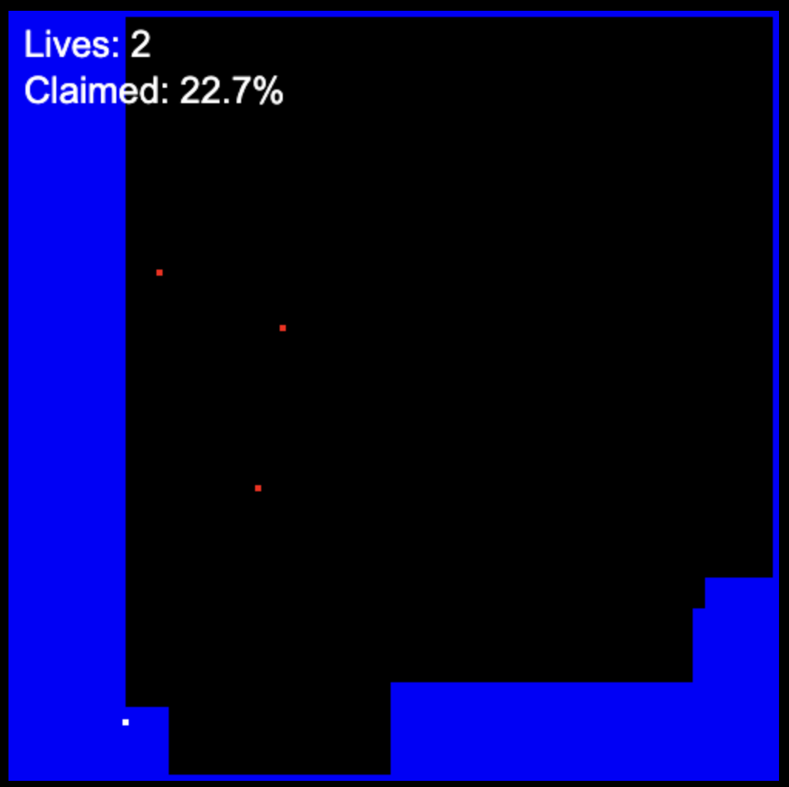

# Volfied / Qix clone

## Description

This is a clone of the game Volfied, which is a clone of the game Qix. The game is made with typescript and the canvas API, build with rsbuild.

## How to play

The goal of the game is to fill the screen. You can move the player with the arrow keys. If you get hit by an enemy or your line gets hit, you lose a life. 

[link](https://yanbrod.github.io/volfied_clone/)

